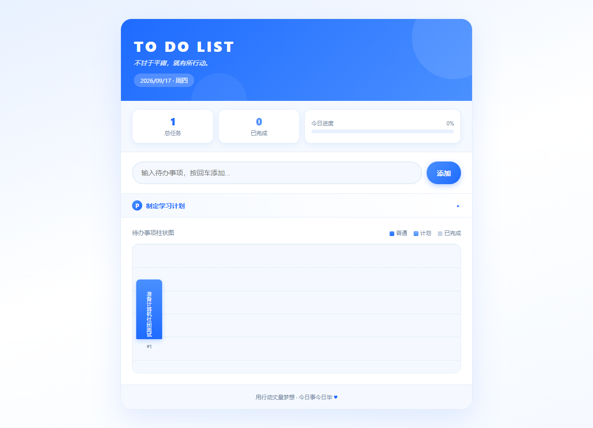

# Todo List

一个零依赖、单文件的中文待办与学习计划应用。它用柱状图展示任务，并实时统计完成进度。

**在线演示：** https://limn12.github.io/student-todo-planner/

## 功能

- 添加、完成和删除待办任务
- 根据当前水平与目标生成五步学习计划
- 显示总任务数、已完成数与进度
- 使用 `localStorage` 自动保存，刷新页面后仍保留数据
- 支持键盘操作与移动端布局

## 运行

直接用现代浏览器打开 `index.html`，无需安装依赖。

## 数据说明

所有任务仅保存在当前浏览器的本地存储中，不会上传到服务器。清除该站点的浏览器数据会同时删除任务。

## 技术

HTML5、CSS3、Vanilla JavaScript。
